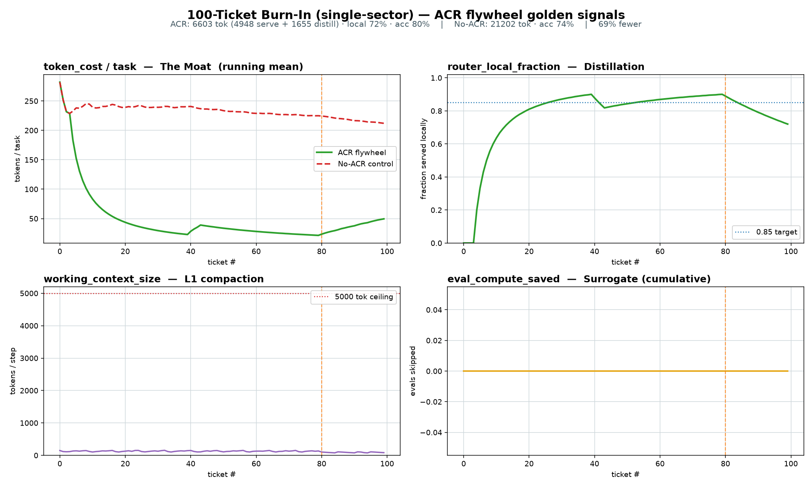

# Bobby: cost-decaying LLM agents via proof-gated distillation to deterministic plugins

*Reading guide: §2.2–2.4 are the core (the distillation gate, the competence router / OOD test, and the cost model);
§2.5–2.8 are the agent, memory, and coordination layers; §3 is the benchmark and §4 reproduces every number. Code
paths are named inline; runnable proofs are under `wiki/proofs/`.*

**Abstract.** LLM agents pay a roughly constant per-task inference cost: every task is a fresh generation. We describe a
runtime that makes that cost *decay* on the reducible part of a workload. When the model repeatedly solves tasks of the
same capability class, an operator discovers a candidate rule offline, accepts it only if it clears a held-out
gain-proof, and freezes it as a deterministic local plugin; a per-query router then serves that class with zero model
calls and abstains back to the model when a query is out of the plugin's competence region. The reducible fraction of
the workload migrates off the model; the irreducible fraction (open judgment/generation) provably stays on it. On a
100-ticket benchmark against a no-distillation control (same engine), using a local Qwen3.6-35B-A3B model, this yields
**−69 % tokens at 80 % vs 74 % accuracy** (single-sector reference run) and **−34 % at 96 % vs 93 %** (6-modality). An
N = 5-seed replication of the single-sector run gives token reduction **62 % ± 20 %** and router-local **64.8 % ± 20 %**
(mean ± 95 % Student-t CI). The agents form a self-organizing multi-agent system (SO-MAS):
decentralized, no orchestrator, no assigned roles — coverage emerges from local moves. Each is a *generative agent*
instantiated from data — a persona (identity + goal) it self-directs against, with a persistent self that survives
context-compaction — and the knowledge it produces is written to a shared store, so it is reusable across agents and
runs. All results are reproduced by scripts in `wiki/proofs/` and 106 deterministic checks.

---

## 1. Problem

Let a workload be a stream of tasks $t_1,\dots,t_N$, each in a capability class $c(t)\in\mathcal C$. A class is
*reducible* if some deterministic function reproduces the model's outputs on it (extraction, aggregation, mechanical
transforms, closed algorithms) and *irreducible* otherwise (open judgment, creative generation). A standard agent
pays $p$ tokens per task regardless of history, so total cost is $C=pN$. The question: can a class, once seen enough,
be served without the model — safely, i.e. without misapplying a frozen rule to a task it does not fit?

## 2. Method

### 2.1 Runtime: an event-sourced plugin engine

An append-only event log $E$ is the single source of truth; every subsystem is a fold over $E$ (blackboard, router
state, telemetry). The engine is an event bus + a plugin registry + an interceptor (router) + a stateless worker pool
(`bobby_squad/engine.py`). A **plugin** is any $\pi:\text{payload}\to\text{result}$ carrying (i) capability tags, (ii)
a proof record, (iii) a competence region. The registry rejects functional twins by AST fingerprint.

### 2.2 The distillation operator (ACR)

For a family $F$ with held-out examples $H_F=\{(x_j,y_j)\}_{j=1}^m$, define

$$
\mathcal D(F)=
\begin{cases}
\text{freeze}(h^\star), & s(h^\star)\ge\tau\\[2pt]
\bot\ (\text{stay on the LLM}), & \text{otherwise}
\end{cases}
\qquad
h^\star=\arg\max_{h\in\mathcal H_F} s(h),\quad
s(h)=\frac1m\sum_{j=1}^m \mathrm{F1}\!\big(h(x_j),y_j\big).
$$

$\mathcal H_F$ is a typed hypothesis space per modality: LLM-proposed regexes;
numeric reducers $\{\text{sum, max, min, count, product}\}$; code transforms; or an **LLM-authored** function $\texttt{def solve(x)}$ that is
sandbox-compiled (restricted builtins) before scoring. $\tau=0.9$. A frozen $h^\star$ is deterministic and costs
$\approx 0$ per call. Applying $\mathcal D$ across the stream is a fixed-point iteration: classes migrate from the model
into the plugin set $\Pi$ until only the irreducible classes remain on the model.

### 2.3 Competence routing and the OOD gate

Each plugin $\pi$ stores the embeddings $\{e_k\}_{k=1}^m$ of the queries it was proven on: centroid
$\mu=\frac1m\sum_k e_k$ and diagonal precision $s_d=\big(\sigma_d^2+\lambda\big)^{-1/2}$ (ridge $\lambda$; diagonal
because $m$ is small and the full covariance is singular). For a query embedding $q$ the competence distance is the
diagonal Mahalanobis distance

$$
\Delta_\pi(q)=\sqrt{\textstyle\sum_d s_d^2\,(q_d-\mu_d)^2},\qquad
\text{OOD}_\pi(q)\iff \Delta_\pi(q)>\theta_\pi,\quad
\theta_\pi=\bar\Delta+k\,\mathrm{std}(\Delta),\ k=2.5,
$$

with $\bar\Delta,\mathrm{std}(\Delta)$ over the in-sample distances. Among plugins covering the query's capability the
router picks

$$
\pi^\star=\arg\min_{\pi:\ \neg\text{OOD}_\pi(q)}\Delta_\pi(q),
$$

and **abstains to the model** if every covering plugin is OOD (fail-safe). This is what lets distinct distilled skills
share a capability tag without cross-application, and what keeps irreducible tasks on the model. Code: `router.py`.

### 2.4 Cost model

Let $f_\text{local}$ be the router-local fraction (share of tasks served by a plugin). Expected per-task serving cost is
$\mathbb E[\text{cost}]=p\,(1-f_\text{local})$, and over the stream

$$
C_\text{ACR}=p\sum_i \mathbb 1[t_i\text{ served by model}] \;+\; \underbrace{\textstyle\sum_{\pi\in\Pi} d_\pi}_{\text{one-time distillation}},
\qquad C_\text{control}=pN .
$$

The distillation term $\sum_\pi d_\pi$ is paid once per class and then **amortized** over every subsequent zero-cost
serve, so its per-task share $\to 0$ as $N$ grows; the marginal cost converges to $p\,(1-f_\text{local})$.
$f_\text{local}$ is bounded above by $1-\rho_\text{irr}-w$, where $\rho_\text{irr}$ is the irreducible fraction and $w$
the warmup share (tasks seen before a class distils). The saving is the gap $C_\text{control}-C_\text{ACR}$; it is only
claimed when confidence intervals separate (§3).

### 2.5 Cross-domain primitives

A *primitive* is a domain-free skeleton $g$ bound per domain by a parameter $\phi_D$ (e.g.
$g=$ `extract_matching`, $\phi_D=$ a regex). It is promoted only if it clears the gate on at least $n$ domains it
was **not** co-fit on:

$$
\Big|\{\,D:\ s(g_{\phi_D},H_D)\ge\tau\,\}\Big|\ \ge\ n\quad(n=2).
$$

Promoted primitives are filed by category and indexed in a persistent semantic memory; before distilling anything, the
engine finds a capability back either **semantically** (cosine over description embeddings) or **structurally** (equal
AST fingerprint after $\alpha$-renaming), so the same logic is never learned twice. Code: `primitive_intel.py`,
`primitive_lib.py`.

### 2.6 Generative agents from data

An agent is a triple $(\text{self},\text{tools},\text{moves})$ with self-directed behavior — no per-step prompt. The
**self** is a persona $(\text{identity},\text{goal},\text{memory})$ instantiated from data: a use case is a role + goal
(a `DataSpec` in `studio/backend/specs.py`). The agent observes the input; its cycle — select-target → plan → act —
chooses how to satisfy the goal. The persona is *persistent* — self and progress live in a pinned tier that compaction
never evicts (`bobby_squad/core.py`) — so a constant character holds across a long session or multi-round world
(the `persona` / `world` pipelines in `studio/backend/runner.py`).

### 2.7 Reusable knowledge

What an agent learns is written back to a shared **knowledge vault** — linked markdown notes with `[[wikilinks]]`, on
disk and versioned — which agents *read* (navigate the relevant subgraph for the current step) and *enrich* (new notes,
auto-linked, deduped, with provenance). Because the store is shared and persistent, knowledge is reusable across agents
and across runs: run $k{+}1$ starts from run $k$'s notes, and a proven persona/behavior can be replayed. This closes
the generative → static → plugin loop from the memory side: distilled plugins (§2.2) and vault knowledge are two forms
of the same reuse — cheap deterministic capability, and navigable memory. Code: `vault.py`.

### 2.8 SO-MAS layer

Agents drain a recursive shared board: a `verify` predicate (run, don't ask) decides done-vs-split, an under-covered
unit is split and re-queued, and the loop reaches a fixed point (coverage) when the board drains — no orchestrator, no
assigned roles. Code: `squad.py`, `blackboard.py`.

## 3. Experiments

**Setup.** Seeded generator, exact set-equality grading (no LLM judge). Every run is compared to a **no-ACR control**:
the identical engine with $\mathcal D$ disabled. Per-task cost counts serving tokens only (0 for a plugin); the one-time
distillation cost is reported separately and included in the total. Model: Qwen3.6-35B-A3B (sglang, thinking off);
embeddings: nomic-embed-text (768-d). A gain is reported only when CI-separated:
$\text{lo}=\Delta-(\mathrm{ci}_\text{ACR}+\mathrm{ci}_\text{ctrl})>0$.

| Run | Tokens ACR (serve + distill) | Tokens ctrl | $\Delta$ | Acc ACR / ctrl | $f_\text{local}$ |
|---|---|---|---|---|---|
| Single-sector, $N{=}100$ | 6,603 (4,948 + 1,655) | 21,202 | −69 % | 80 % / 74 % | 72 % |
| Cross-modal, $N{=}180$, 6 modalities | 14,613 (10,234 + 4,379) | 22,288 | −34 % | 96 % / 93 % | 58 % |

N = 5 seeds (single-sector), mean ± 95 % CI (Student-t, $n{=}5$, $t_{4}{=}2.776$): $f_\text{local}=64.8\%\pm20.0\%$,
token reduction $62.0\%\pm20.0\%$, accuracy $79.0\%\pm2.2\%$. The wide interval is driven by one seed (seed 5: local
36 %, 1 promotion) — see obs. (ii). Per-modality (% frozen / accuracy): extract 44/99 · math 67/88 · code
67/100 · image 67/100 · algo 67/92 · **prose 0/100** — the irreducible class is never distilled and never misrouted,
exactly as §2.3 requires.

**Observations.** (i) Frozen plugins *exceed* the control's accuracy on reducible classes, because a deterministic rule
does not make the format/arithmetic slips the model occasionally makes. (ii) The wide N = 5 CI is a real signal: on one
seed the model proposed a below-$\tau$ regex for one cluster, so that cluster correctly stayed on the model
(1 promotion vs 2) — distillation reliability is proposal-limited, and the gate refusing a weak rule is the intended
behavior. (iii) SO-MAS coordination alone lifts coverage from 21 % (one-pass) to 96 % (recursive squad) on the same
model.



## 4. Reproducibility

```bash
pip install -e .
export BOBBY_LLM_URL=http://localhost:8000/v1/chat/completions BOBBY_LLM_MODEL=your-model
export BOBBY_EMBED_URL=http://localhost:11434/api/embed

python wiki/proofs/run_burn_in_live.py          # single-sector burn-in  → §3 row 1
python wiki/proofs/run_burn_in_mixed_live.py    # cross-modal            → §3 row 2
python wiki/proofs/run_burn_in_sweep.py         # N=5 CI                 → §3 CI line
```

114 deterministic checks (no network) reproduce every mechanism — the gate, the OOD router, cross-domain
generalization, LLM-authored-code distillation, the persistent library, the SO-MAS coordination world, and the
execution-graded SWE-bench-style set (real bugs graded by running their tests):

```bash
for t in test_burn_in test_all_layers test_algo_distill test_primitives test_primitive_autoload \
         test_primitive_lib test_ops_world test_swe_bench; do python wiki/proofs/$t.py; done
```

Design and code map: [docs/DESIGN.md](docs/DESIGN.md) · benchmark detail: [docs/BENCHMARK.md](docs/BENCHMARK.md) ·
primitives: [docs/PRIMITIVES.md](docs/PRIMITIVES.md).

## 7. Extensions (measured)

Two capabilities added on top of the core, each proof-gated and measured against a control on the same local
Qwen3.6-35B-A3B. Detail + repro: [docs/EXTENSIONS.md](docs/EXTENSIONS.md).

### 7.1 Disagreement-gated consensus (Sheaf-ADMM harvest)

The default squad harvest is a set union ([squad.py](bobby_squad/squad.py)): every item any agent proposes is kept,
so a single noisy agent's hallucination survives. `sheaf_consensus` ([bobby_squad/sheaf_consensus.py](bobby_squad/sheaf_consensus.py))
ports the ADMM coordination core of *Learning Multi-Agent Coordination via Sheaf-ADMM* (Seely, Cupiał, Jones — ICML
2026, arXiv:2605.31005) to the discrete extraction setting: agents = nodes, the shared "edge space" is the semantic
embedding space (the sheaf restriction map), and consensus keeps a fact only when the squad corroborates it. It is
**conditional by construction** — it auto-detects the regime and falls back to plain union when agents *partition* the
work (disjoint coverage, as in `confirm_coordination`), so it is a safe drop-in default (`make_consensus_harvest`).

Measured (3-agent fact extraction, F1 vs the union harvest), at ~0 extra LLM calls:

| injected agent noise | union F1 | consensus F1 |
|---|---|---|
| none | 0.99 | 1.00 (+1 %) |
| light | 0.85 | 1.00 (+18 %) |
| medium | 0.80 | 0.98 (+23 %) |
| heavy | 0.68 | 0.97 (**+42 %**) |

Parity on clean/disjoint work; the gain grows with agent unreliability (mixed/weak models, high temp, adversarial
input). 13 deterministic checks: [wiki/proofs/test_sheaf_consensus.py](https://github.com/Moun1r1/Bobby-Self-Organizing-Agent-Squad/blob/main/wiki/proofs/test_sheaf_consensus.py).

### 7.2 SOMA continuous-distillation flywheel

Closes README §6.5 (persist skills across runs; distill → finetune). Two turns, both measured:

* **Cheap turn — skill persistence.** `PluginStore` ([bobby_squad/soma_flywheel.py](bobby_squad/soma_flywheel.py))
  snapshots proof-gated frozen plugins (handler recipe + `OODGate`) and rehydrates them into the next run
  (`burn_in.run(preload=…)`), so run k+1 starts warm. Measured: run 2 spends **−51 % tokens at equal accuracy** and
  serves more locally (80 % vs 72 %) because plugins fire from ticket 1 — zero re-distillation.
* **Compounding turn — distill → finetune.** `DistillationCorpus` emits verified `(prompt → output)` SFT records
  (only plugin-served or graded-correct traces, so every label is trustworthy). A LoRA fine-tune of a `qwen3-4b`
  base on that corpus, evaluated with a paired bootstrap CI, lifts held-out accuracy **71.8 % → 88.2 %
  (Δ +16.5 %, 95 % CI [+12.2 %, +21.0 %], CI-separated; McNemar +79/−13)**, improving every task family
  (image 0→100, math 47→71, algo 64→75, extract 85→91, code 95→100).

An orchestrator arbitrates the single GPU end-to-end (readiness → offload the serving model → train → statistical
gain-gate → merge → swap → serve → confirm), so the flywheel runs on one box without ever serving and training at
once. 20 deterministic checks: [wiki/proofs/test_soma_flywheel.py](https://github.com/Moun1r1/Bobby-Self-Organizing-Agent-Squad/blob/main/wiki/proofs/test_soma_flywheel.py).

## References

**Multi-agent systems & self-organization.** B. Hayes-Roth, "A blackboard architecture for control," *Artificial
Intelligence* 26(3), 1985. Stigmergy / self-organizing software (swarm coordination without a central controller).
Open frameworks: [Mesa](https://github.com/projectmesa/mesa) (agent-based modeling),
[CrewAI](https://github.com/crewAIInc/crewAI), [LangGraph](https://github.com/langchain-ai/langgraph).
J. Seely, B. Cupiał, L. Jones, "Learning Multi-Agent Coordination via Sheaf-ADMM," ICML 2026, arXiv:2605.31005 —
the consensus core ported in §7.1 ([SakanaAI/sheaf-admm](https://github.com/SakanaAI/sheaf-admm)).

**Generative agents & memory.** J. S. Park et al., "Generative Agents: Interactive Simulacra of Human Behavior,"
arXiv:2304.03442, 2023. N. Shinn et al., "Reflexion," arXiv:2303.11366, 2023.

**Skill libraries & self-improvement (the distillation lineage).** G. Wang et al., "Voyager: An Open-Ended Embodied
Agent with Large Language Models," arXiv:2305.16291, 2023 — an ever-growing library of verified, LLM-authored skills;
this work adds a gain-proof gate and a cross-domain generalization test. T. Schick et al., "Toolformer,"
arXiv:2302.04761, 2023.

**Reasoning & verification.** S. Yao et al., "ReAct," arXiv:2210.03629, 2022. S. Dhuliawala et al.,
"Chain-of-Verification," arXiv:2309.11495, 2023.

**Out-of-distribution detection.** P. C. Mahalanobis, "On the generalised distance in statistics," 1936. K. Lee et
al., "A Simple Unified Framework for Detecting Out-of-Distribution Samples," arXiv:1807.03888, 2018 (Mahalanobis-based
OOD scoring).

**World models & software-agent benchmarks.** D. Hafner et al., "DreamerV3," arXiv:2301.04104, 2023.
C. E. Jimenez et al., "SWE-bench," arXiv:2310.06770, 2023. Baselines:
[OpenHands](https://github.com/All-Hands-AI/OpenHands), [Aider](https://github.com/Aider-AI/aider).

**Engineering patterns.** Event sourcing / CQRS — an append-only log as the single source of truth, all state a
projection of it.

MIT — see [LICENSE](LICENSE).
