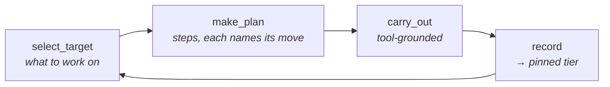
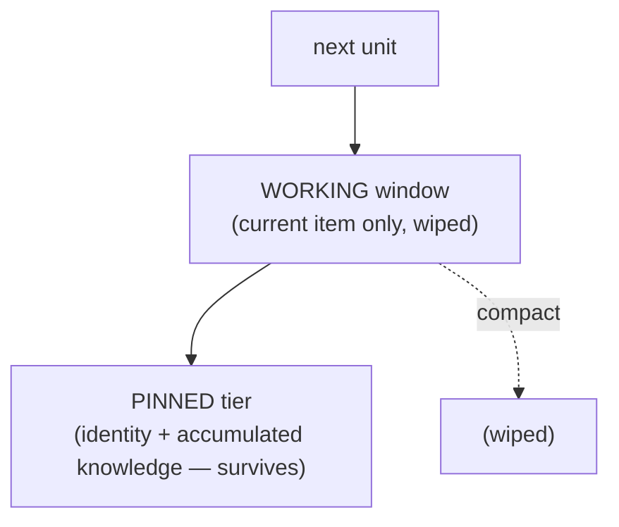
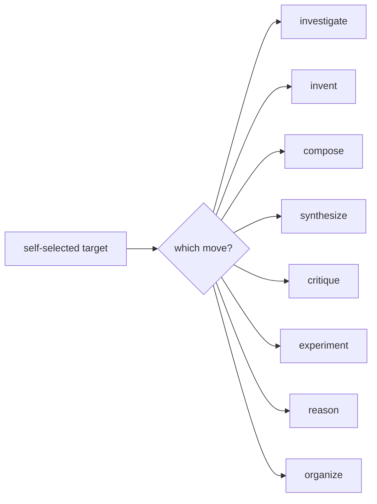
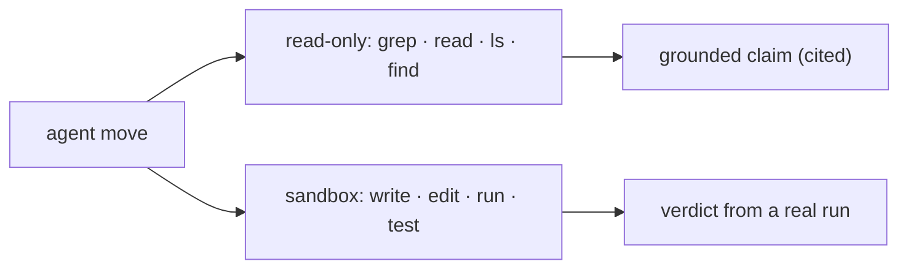
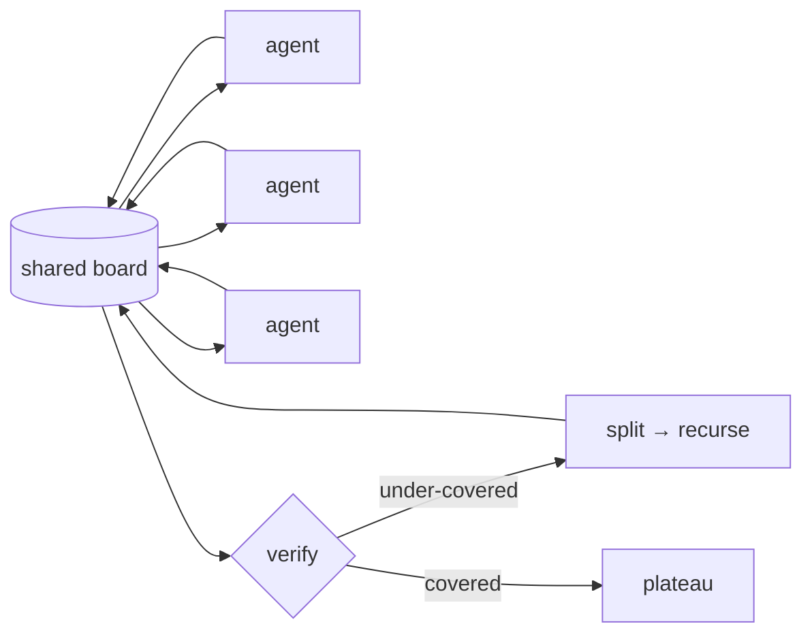
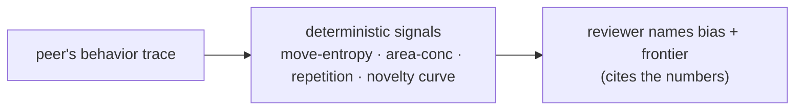
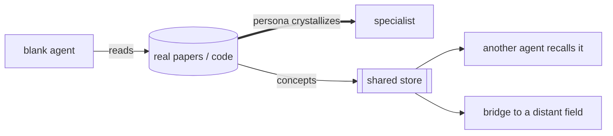

# The Generative Engine — Layer by Layer

[← back to home](./)

There is no scripted pipeline and no static per-step prompt. The behavior emerges from **stacked layers**, each a
real mechanism with a proof. Read top to bottom — every layer adds one capability, and none of them tells the agent
*what to say*.

### One squad run, every layer firing — real counts (2 agents × 2 cycles)

| layer | fired |
|---|---|
| **L0** targets self-selected | **4** |
| **L0** plan steps generated | **16** |
| **L2** moves chosen | **13** · 7 distinct · diversity **0.54** |
| **L2** move distribution | `investigate 4 · verify 3 · extract 2 · synthesize · compose · analyze · critique` |
| **L3** tool calls (grounding) | **130** · `read 106 · find 13 · ls 10 · grep 1` |
| **L1** records → pinned tier | **13** |

Every move and every tool call was the agent's **own** choice — no step was scripted. → [engine_trace.py](https://github.com/Moun1r1/Bobby-GenAi-Squad/blob/main/wiki/proofs/engine_trace.py)

---

## Layer 0 — The self-directed loop

The agent chooses its **own** target and its **own** move each step. `GUIDANCE_WF` injects only identity + goal +
progress and asks the model to *choose* — a frame, never a script.



> **The one test for every layer:** does it *prescribe behavior* (banned) or *frame the model to self-direct*
> (allowed)? Adding a move the agent can select is fine; adding a prompt that makes it comply is not.

---

## Layer 1 — Persistent-self (two tiers)

Identity, goal, and accumulated knowledge live in a **pinned tier** compaction never touches; the working window is
a tiny scroll that's wiped between items. The prompt stays flat no matter how long the horizon.



**Proven:** streaming 25 large codebases, pinned prompt stayed **≤ 4,689 tokens** while a keep-everything agent
would reach **~40,075** — **8.5×** less, nothing lost. → [long-horizon proof](https://github.com/Moun1r1/Bobby-GenAi-Squad/blob/main/wiki/proofs/squad_reads_code.py)

---

## Layer 2 — Open move-space

The agent **names its own move** per step — not a fixed enum. Across real runs the swarm self-selected a dozen
distinct moves with no move hardcoded:



**Observed** (emergent, unprompted): `investigate · invent · compose · synthesize · critique · experiment · reason ·
wire · select · verify · index · map`. A "critic" is a *move any agent takes*, not a persona anyone assigned.

---

## Layer 3 — Tools (grounding: verify before you claim)

Capability comes from what the agent can *do*, not what it's told to say: read-only investigation (grep / read / ls
/ find) and a sandbox (write / edit / run / test). Verdicts come from **execution**, not a rubric.



This killed the biggest failure mode — "X is missing/broken" claims from a partial view. Given full code, the same
squad produced **zero** "it's missing" confabulation and found real bugs.

---

## Layer 4 — Self-organization (the squad)

No role chart. General agents share one board and each self-selects the move the work needs (the Sequential
protocol). Coverage recurses into what's under-done; plateau = the board drains.



**Proven:** recursive coordination lifts function-coverage far above a solo pass on the same model.
→ [squad_solve](https://github.com/Moun1r1/Bobby-GenAi-Squad/blob/main/wiki/proofs/organization_recursive.py)

---

## Layer 5 — The board (IdeaLedger)

A shared idea board with three code-level guarantees, and **emergent, agent-assigned states** on top (no hardcoded
lifecycle — the swarm labels its own board).

- **Identity floor** — a near-duplicate of anything on the board is repelled → the swarm never *regenerates* an idea.
- **Active repulsion** — the board surfaces the *most-spread* ideas, pushing agents toward gaps, not the dense cluster.

**Proven:** idea-space gate **+22.5%** diversity vs a lexical gate; active repulsion **+74%** concept coverage — both
with clean negative controls. → [idea-gate](https://github.com/Moun1r1/Bobby-GenAi-Squad/blob/main/wiki/proofs/proposals_gain.py)

---

## Layer 6 — Self-evolving memory policy

A bounded store self-governs retention by **learned usage** (retrieval raises an item's value; overflow evicts the
lowest; critical items pinned = a deterministic recall floor).

**Proven:** **+25%** retention / **+12.5%** downstream generation vs a fixed rule — and with *non-predictive* usage
the effect vanishes (negative control passed), so it's a real signal, not an artifact.

---

## Layer 7 — Metacognition (self-review)

An agent reviews a peer's **real behavioral trace** and detects its bias (move/area concentration, repetition) and
frontier (where novelty collapses) — grounded in deterministic signals, not vibes. A self-model loop a single
one-pass call can't run on itself.



---

## Layer 8 — Verify &amp; Prove

Two enforced methodologies: **verify** is run-**don't**-ask (a real run gates "done", never prose); **prove** enforces
test *validity* — a headroom guard (ceilinged → INCONCLUSIVE), a negative-control guard (leaks → INVALID), and
replication (seeds + CI). Most proposals **fail** a fair A/B — that's the point.

→ [prove](https://github.com/Moun1r1/Bobby-GenAi-Squad/blob/main/wiki/proofs/memory_policy_gain.py)

---

## Layer 9 — Persona from data, and transfer

The top layer: an agent **becomes the data it reads** — its persona crystallizes into a specialist grounded in the
material — and that knowledge is stored, recalled by *other* agents, and carried **across domains**.



**Proven:** an agent that read only a *logic* paper correctly explained a *physics* paper it never read (grounded);
the squad read **12 sectors** and bridged e.g. **neuroscience → economics**, **complex-systems → AI**.
→ [transfer](https://github.com/Moun1r1/Bobby-GenAi-Squad/blob/main/wiki/proofs/cross_sector_knowledge.py)

---

[← back to home](./) · [all proofs](https://github.com/Moun1r1/Bobby-GenAi-Squad/tree/main/wiki/proofs)

<script type="module">
  import mermaid from 'https://cdn.jsdelivr.net/npm/mermaid@10/dist/mermaid.esm.min.mjs';
  // GitHub renders ```mermaid natively; on the Jekyll Pages site the same fence
  // becomes <pre><code class="language-mermaid"> — convert those so mermaid picks them up.
  document.querySelectorAll('pre > code.language-mermaid').forEach((code) => {
    const el = document.createElement('pre');
    el.className = 'mermaid';
    el.textContent = code.textContent;
    code.parentElement.replaceWith(el);
  });
  mermaid.initialize({ startOnLoad: true, theme: 'neutral' });
</script>
