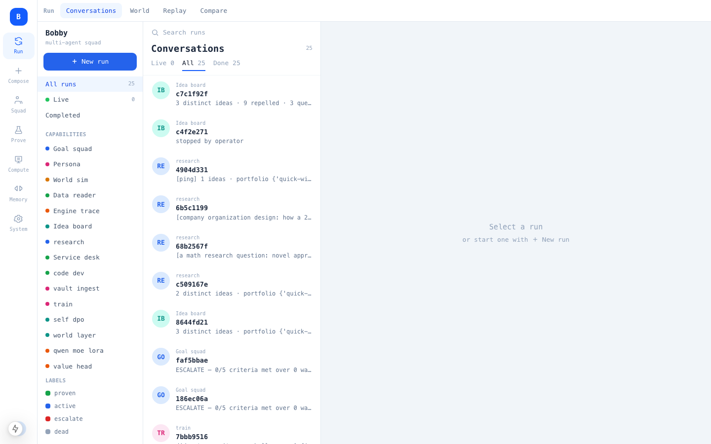
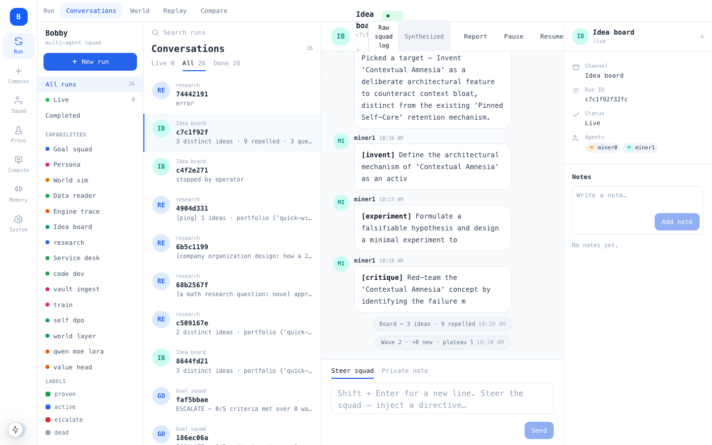
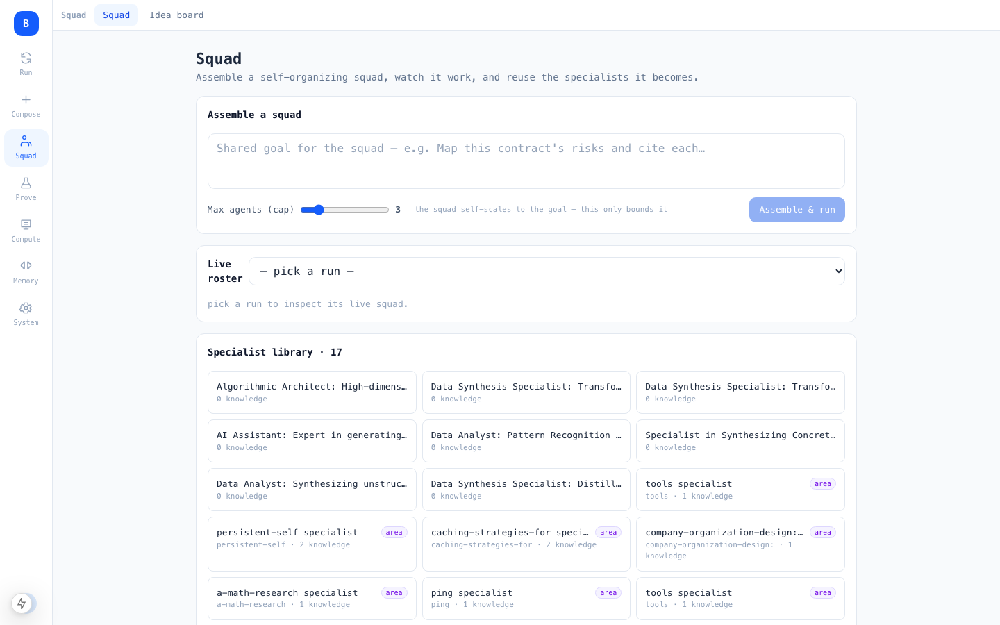
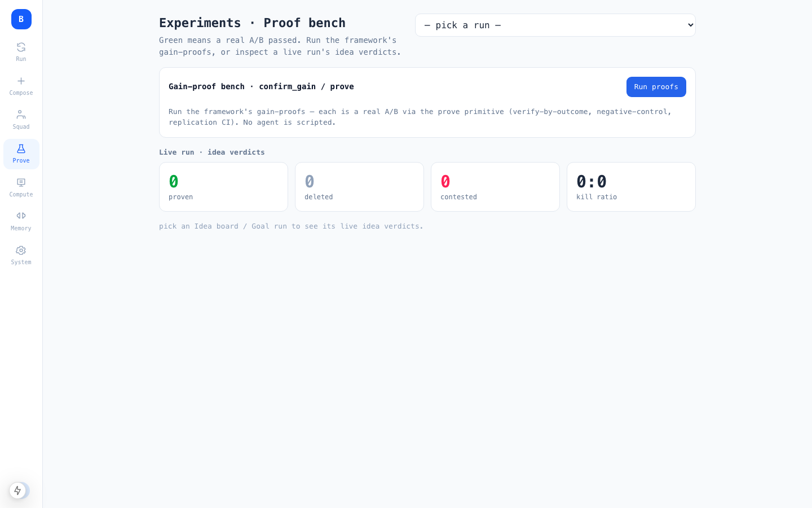

# Interface — the Studio screens

Studio is a Next.js + tRPC app that talks to the FastAPI backend. It's organized **by engine layer, not a flat menu**:
a left rail of layers (Run · Compose · Squad · Prove · Compute · Memory · System), each opening its related screens as
sub-tabs. You *watch the generative loop happen* rather than read logs.

*The left rail **is** the engine layers (Run · Compose · Squad · Prove · Compute · Memory · System); each opens its
screens as sub-tabs. The shots below are real captures of the running app against a live backend — no mockups.*

---

## Run — the generative loop, live

- **Conversations** — the default. Launch/attach a run and watch its event stream turn-by-turn: each agent's
  `target → plan → move → tool → verify`, the pinned-tier memory growing, and the final result. This is the "watch it
  think" screen.
- **World** — the run rendered as a live world: agents, the shared board, and the moves happening on it.
- **Replay (Timeline)** — scrub a finished run's event timeline to inspect how it unfolded.
- **Compare** — put two runs side by side (different SELF / model / params) and diff their behavior and outcomes.

## Compose — define the SELF

- **Workflows** — create a run from a **SELF** (identity + goal + constraints) — no prompt scripting; the engine
  drives. This is where you point the swarm at a task.
- **Datasets** — register the material a run reads (text, files, a source path/URL) that becomes the world-context.

## Squad — coordination

- **Squad** — the `squad_solve` view: the recursive shared board draining, units splitting and re-queuing, and
  per-agent coverage — the "did we cover it all?" picture.
- **Idea board** — the `IdeaLedger`: proposals with the identity-floor dedup, agent-assigned states, and the
  active-repulsion frontier that pushes agents toward gaps.

## Prove — verify by outcome

- **Proof bench** — the `prove` results: each mechanism's A/B with its headroom + negative-control + CI guards and its
  verdict (`WIRE / MARGINAL / DELETE / INCONCLUSIVE / INVALID`). Most proposals *fail* a fair test — that's the point.

## Compute — the GPU worker, in realtime

Works with **any CUDA GPU host** (a workstation, a cloud VM, a cluster node) over SSH + Docker — not a specific product.

- **Compute** — the training control room. A realtime monitor (GPU util/temp/power, memory bar, CPU, disk, running
  containers, a **safe-to-train** badge from the pre-train gate) sits above the live run: the worker's file tree, the
  stream of **worker actions** (push/run/pull with exit codes), the **self-DPO preference-pairs** panel
  (pattern · critique · chosen ≻ rejected), the **encoder-bank** result (world hub conditions value + monitor, with the
  auto-DPO harvest count), the **world transformer layer** result (with-world vs without-world held-out), and the
  agent's live **introspection**. This is where you watch a model get trained and gate it on a real challenge.

## Memory — persistent-self + knowledge

- **Memory** — the persistent-self two tiers made visible: the pinned tier (self-core + progress, immune to
  compaction) vs the working window, and the evolved retention policy (what `SemanticMemory` keeps vs evicts).
- **Knowledge vault** — the navigable graph. An interactive node-link view of every vault (nodes colored by vault,
  sized by link count); click a note to read its markdown and **hop its `[[links]]`** (including cross-vault edges); a
  live **Navigate** box shows exactly the semantic-entry + subgraph an agent would recall for any query, and whether
  recall is `cosine` or `learned`.
- **Knowledge map** — a 2D projection of the knowledge embeddings (what the swarm has learned, spatially).
- **Notebook** — a scratch/report surface for a run's accumulated notes.

## System — ops & config

- **Analytics** — run/throughput stats. **Cost** — token/cost accounting. **Models** — the endpoints the engine talks
  to. **Approvals** — HITL gates (never auto-approved). **Settings** — configuration.

---

See also: **[Architecture »](architecture)** · **[What's new »](whats-new)**.
